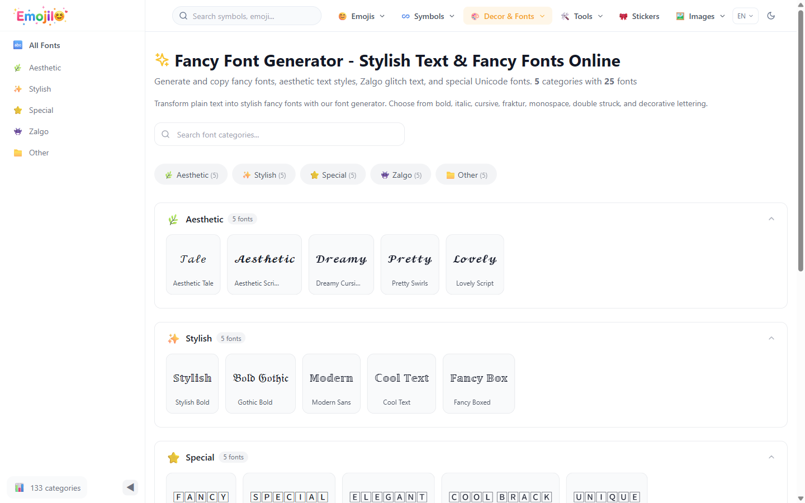
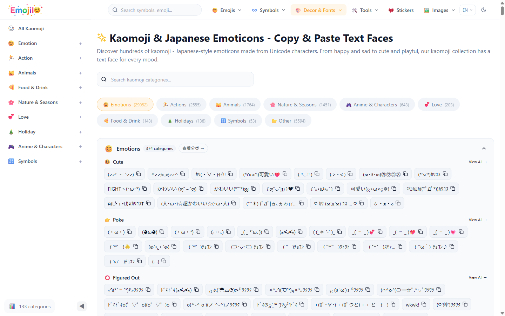
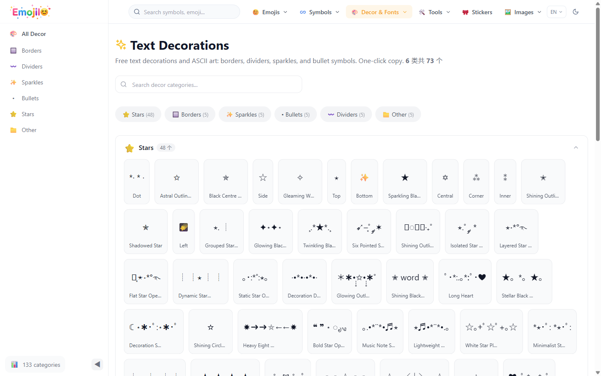

# EmojiIO — Emoji & Special Characters Database

> 🚀 **Live website**: [https://emojiio.com](https://emojiio.com) | **在线使用**: [https://emojiio.com/zh](https://emojiio.com/zh)

---

[🇬🇧 English](#-english) · [🇨🇳 中文](#-中文)

---

## 🇬🇧 English

**EmojiIO** is a comprehensive open database of emojis, kaomoji (Japanese emoticons), fancy Unicode fonts, and decorative symbols. Perfect for developers, designers, and anyone who loves expressive text.

### ✨ Features

**🔍 5000+ Emojis with Platform Previews**
Browse emojis grouped by category — smileys, animals, food, travel, objects, symbols, and more. Each emoji includes previews from **25 platforms** (Apple, Google, Samsung, Twitter, etc.).

**🎨 Fancy Unicode Fonts**
Generate stylish text with 25+ Unicode font styles — bold script, gothic, double-struck, monospace, and fraktur. One-click copy & paste.

**☺️ Kaomoji (Japanese Emoticons)**
Hundreds of text-based emoticons organized by emotion and theme: `(◕‿◕✿)` `(╯°□°)╯︵ ┻━┻`

**🎀 Decorative Symbols & Borders**
Stars, hearts, arrows, dividers, chess pieces, music notes, and ASCII art frames.

**🌍 4 Languages**
English · 中文 · Español · 한국어

### 📁 Data Structure

```
data/
├── emojis/                 # Emoji data by category
│   ├── smileys-emotion.json
│   ├── animals-nature.json
│   ├── food-drink.json
│   ├── travel-places.json
│   ├── activities.json
│   ├── objects.json
│   ├── symbols.json
│   └── flags.json
├── kaomoji.json            # 200 Kaomoji emoticons
├── fonts.json              # 25 fancy font styles
├── decorative-symbols.json # 73 decorative symbols
└── categories.json         # All 133 categories
```

### 📸 Screenshots

| Emoji Search | Fancy Fonts |
|:---:|:---:|
|  |  |
| **Kaomoji** | **Decorative Symbols** |
|  |  |

### 🛠️ Tech Stack

- **Frontend**: Next.js (App Router)
- **Backend**: Express.js + PostgreSQL
- **Styling**: Tailwind CSS
- **Deployment**: PM2 + Nginx

### 🔗 Links

- **Website**: [https://emojiio.com](https://emojiio.com) — Try it live!
- **Product Hunt**: *Coming soon*

### 📄 License

MIT

---

## 🇨🇳 中文

**EmojiIO** 是一个全面的 Emoji、颜文字（日式表情符号）、花式 Unicode 字体和装饰符号的开放数据库。适合开发者、设计师以及任何喜欢表达性文字的人。

### ✨ 功能介绍

**🔍 5000+ Emoji，支持 25 个平台预览**
按分类浏览 Emoji — 笑脸、动物、食物、旅行、物体、符号等。每个 Emoji 都包含来自 **25 个平台**（Apple、Google、Samsung、Twitter 等）的预览图。

**🎨 花式字体**
使用 25+ 种 Unicode 字体样式生成时尚文字 — 粗体手写体、哥特体、双线体、等宽体、花体等。一键复制粘贴。

**☺️ 颜文字（日式表情符号）**
数百个按情绪和主题分类的文字表情：`(◕‿◕✿)` `(╯°□°)╯︵ ┻━┻`

**🎀 装饰符号和边框**
星星、爱心、箭头、分隔线、国际象棋、音符和 ASCII 艺术框架。

**🌍 4 种语言支持**
English · 中文 · Español · 한국어

### 📁 数据结构

```
data/
├── emojis/                 # 按分类整理的 Emoji 数据
│   ├── smileys-emotion.json
│   ├── animals-nature.json
│   ├── food-drink.json
│   ├── travel-places.json
│   ├── activities.json
│   ├── objects.json
│   ├── symbols.json
│   └── flags.json
├── kaomoji.json            # 200 条颜文字
├── fonts.json              # 25 种花式字体
├── decorative-symbols.json # 73 个装饰符号
└── categories.json         # 全部分类（133 个）
```

### 📸 功能截图

| Emoji 搜索 | 花式字体 |
|:---:|:---:|
|  |  |
| **颜文字** | **装饰符号** |
|  |  |

### 🛠️ 技术栈

- **前端**: Next.js (App Router)
- **后端**: Express.js + PostgreSQL
- **样式**: Tailwind CSS
- **部署**: PM2 + Nginx

### 🔗 链接

- **在线使用**: [https://emojiio.com/zh](https://emojiio.com/zh) — 立即体验！
- **Product Hunt**: *即将上线*

### 📄 开源协议

MIT
